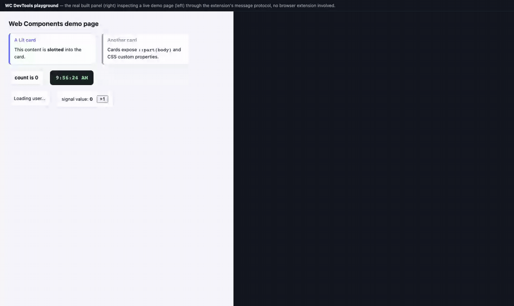

# Web Components DevTools

Browser DevTools for inspecting and debugging Web Components — the component-level view that Vue DevTools and React DevTools give their frameworks, for Lit, FAST, Stencil and vanilla custom elements.

[](https://github.com/jpinhel/wc-devtools/actions/workflows/ci.yml)




## vs. the browser's Elements panel

| | Elements panel | WC DevTools |
|---|---|---|
| Component tree (only custom elements, shadow DOM pierced) | ❌ mixed with every div | ✅ |
| JS properties (not just attributes) | ❌ | ✅ live-editable |
| `adoptedStyleSheets` | ❌ invisible | ✅ with CSS viewer |
| Exposed `::part`s + rules targeting them | ❌ | ✅ |
| `ElementInternals` custom states (`:state()`) | ❌ | ✅ toggleable |
| Events per component | ❌ | ✅ log + dispatch |
| Invoke component methods | console only | ✅ one click |
| Re-render profiling / trace updates | ❌ | ✅ |
| Click-to-source on the component class | ❌ | ✅ |
| CEM documentation in place | ❌ | ✅ + auto-fetch |

## Features

- **Component tree** — full hierarchy of custom elements, shadow DOM included, virtualised (comfortable on 5000+ elements), with iframe support (Storybook works)
- **Live editing** — properties, attributes and CSS custom properties, editable in place; reset to first-seen value per row
- **Methods** — list user-defined methods and **invoke them** with JSON arguments, result inline (Promises awaited)
- **Events** — real-time `CustomEvent` log per component, plus **dispatch your own** events from the panel
- **Click-to-source** — jump to the file that registered the component, source maps applied (`src` button)
- **Trace updates** — flash components on the page as they re-render (toolbar toggle)
- **Re-render profiling** — top components by update frequency over a rolling window (Perf tab)
- **Picker** — click a component on the page to select it in the tree
- **Console bridge** — the selected component is `$wc` / `$wc0` in the console (`$wc1..$wc4` keep history)
- **Framework detection** — Lit (with version), FAST, Stencil (with SSR/hydration badges), vanilla

## Why WC DevTools

These exist only in Web Components — no other devtools shows them:

- **Slots** — assigned vs fallback nodes per `<slot>`, plus how many `::slotted` rules target the host's shadow root.
- **`::part` exposures** — every part exposed inside a shadow tree, with the count of CSS rules currently targeting it.
- **adoptedStyleSheets** — constructible stylesheets applied to a shadow root (invisible in the browser's Elements panel), in a CodeMirror CSS viewer.
- **CSS custom properties** — variables resolving on the host with computed values and host/inherited origin — **editable live**, the design-system theming workflow.
- **CustomStateSet** — active states from `ElementInternals.states` (`:--loading`, `:--ready`…), with click-to-remove chips.
- **Cross-root ARIA** — `aria-controls`, `aria-describedby` etc., flagged when the target lives in a different (shadow) root than the source.
- **`@state` vs `@property` distinction** — internal state and public properties visually badged (Lit `elementProperties`, Stencil `cmpMeta$`).
- **Lit Labs integration** — Signals tab for `@lit-labs/signals` values, `@lit/context` request keys, and `@lit/task` status.
- **Custom Elements Manifest** — loads your project's `custom-elements.json`, and auto-fetches the manifest of known design systems (Shoelace, Web Awesome, Vaadin, UI5, Lion) for instant docs on the CEM tab.
- **Stencil hydration badges** — tell SSR-only nodes from hydrated ones at a glance.

## Install

### From source

Requirements: [Bun](https://bun.sh) ≥ 1.2

```bash
git clone https://github.com/jpinhel/wc-devtools.git
cd wc-devtools
bun install
bun run build
```

Then load the unpacked extension from `.output/chrome-mv3` in `chrome://extensions` (enable Developer mode first).

### Development

```bash
bun run dev
```

WXT will auto-reload the extension on file changes.

### Playground

```bash
bun run build && bun run playground   # → http://localhost:5180
```

Runs the real built panel against a demo page in a plain browser tab (no
extension involved) — the extension's message protocol bridged by
`playground/harness.js`. Used as a reproducible manual-testing target and to
record the README GIF (`bun playground/record-demo.ts`).

## Usage

1. Open DevTools on any page (`F12`)
2. Go to the **Web Components** tab
3. The component tree appears automatically
4. Click a node to inspect its properties, attributes, methods, and events
5. Click a property value to edit it live — booleans toggle on click

## Architecture

```
entrypoints/
  background.ts        — MV3 service worker, message routing, badge
  content.ts           — bridge between page context and extension bus
  wc-inspector.ts      — injected into page (world: MAIN), reads the DOM
  panel/               — DevTools panel (Lit)
  devtools.ts          — registers the DevTools panel
  popup/               — toolbar popup

lib/
  inspector-core.ts    — pure tree-building and serialization logic

types/
  wc.ts                — shared types and message protocol
```

Message flow:

```
wc-inspector (page)
    │ window.postMessage
    ▼
content.ts
    │ chrome.runtime.sendMessage
    ▼
background.ts
    │ port.postMessage
    ▼
DevTools panel (Lit)
```

## Tech stack

| Tool | Role |
|------|------|
| [WXT](https://wxt.dev) | Extension framework (MV3) |
| [Lit](https://lit.dev) | DevTools panel UI (the panel dogfoods Web Components) |
| [Biome](https://biomejs.dev) | Linter + formatter |
| [Vitest](https://vitest.dev) | Unit tests |
| [Bun](https://bun.sh) | Package manager + runtime |

## Scripts

| Command | Description |
|---------|-------------|
| `bun run dev` | Development build with auto-reload |
| `bun run build` | Production build |
| `bun run zip` | Packaged extension ZIP |
| `bun run test` | Run unit tests |
| `bun run lint` | Lint with Biome |
| `bun run lint:fix` | Lint + auto-fix |
| `bun run compile` | TypeScript type-check |

## Contributing

Pull requests are welcome. For significant changes, open an issue first to discuss the approach.

```bash
bun run lint    # must pass
bun run test    # must pass
bun run compile # must pass
```

## License

[MIT](./LICENSE)
